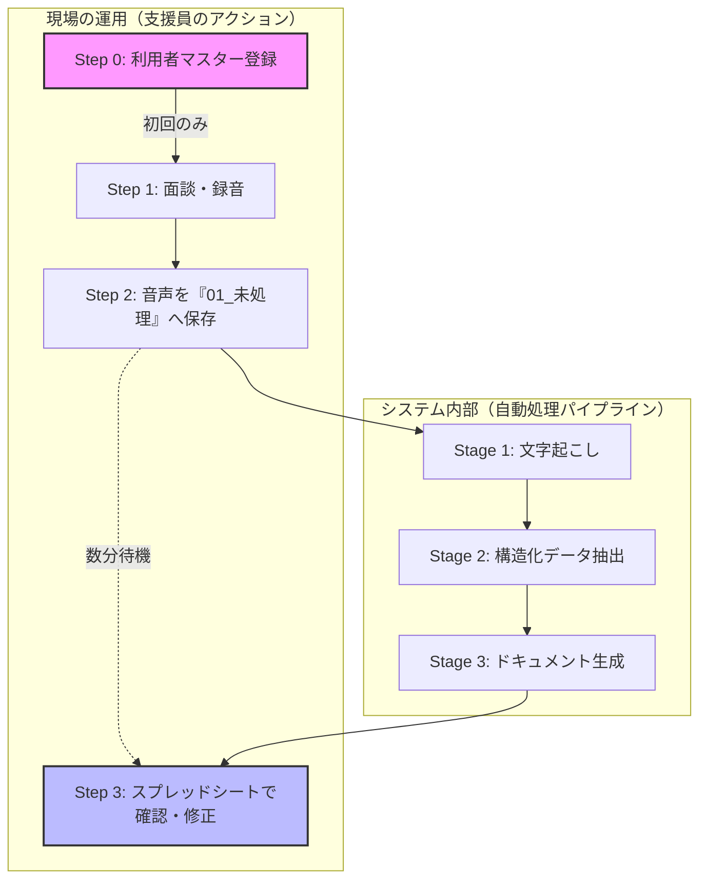

# グローポイント AI支援記録自動化

**「記録の時間は AI に任せ、支援員は『目の前の対話』に集中する」**  
本プロジェクトは、面談音声をアップロードするだけで、モニタリング記録票や就労支援シートの下書きを自動生成する Google Apps Script（GAS）ベースのシステムです。

内部モデルとして最新の **`gemini-2.5-flash`** を採用し、高速かつ精度の高い構造化抽出を実現しています。

### 🔄 全体イメージ

## 📁 日常の運用の流れ

### 【Step 0】利用開始前の準備（初回のみ）
スプレッドシートの **「利用者マスター」** シートへ登録が必要です。ここで登録した名前が、すべての処理の「正解」となります。

### 【Step 1】録音とファイル名（重要：命名規則）
本システムは、ファイル名を **アンダースコア（ `_` ）で区切る** ことで、AIが「誰のデータか」を正確に識別します。

#### ❌ なぜ「田中太郎様.m4a」はダメなのか？
システムは `_` を区切り文字として認識します。区切りがない場合、ファイル名全体（「田中太郎様」）を名前として検索するため、マスターの「田中太郎」と一致せずエラーになります。

#### ✅ 音声ファイル名のルール
- **基本形**: `利用者名_（自由な文字）.m4a`
- **ルール**: 名前の直後に必ず `_` を入れてください。

| ファイル名の例 | 判定 | 理由 |
| :--- | :---: | :--- |
| `田中太郎_面談.m4a` | **OK** | `_` の前が「田中太郎」と判別できる |
| `20260406_田中太郎.wav` | **OK** | `_` で区切られていれば名前を探せます |
| `田中太郎.m4a` | **△** | 処理される場合もありますが、区切りがないと誤認の原因になります |
| `田中太郎様_面談.m4a` | **NG** | 名前が「田中太郎様」として認識されてしまう |
| `田中 太郎_面談.m4a` | **NG** | スペースが含まれると別人とみなされます |

---

## 🛠 開発者・管理者向けセットアップ

### 初回セットアップとフォルダ管理
1. **フォルダの作成**: 「初回セットアップ」を実行すると、**Google Driveのルート（一番上の階層）**に管理用フォルダが自動作成されます。
2. **フォルダの移動**: 作成されたフォルダは、共有ドライブや他のフォルダ内へ自由に移動して構いません。
3. **プロパティの更新**: フォルダを移動したり、手動でフォルダを作り直した場合は、Apps Scriptの「スクリプト プロパティ」にある各 `FOLDER_ID_...` を新しいフォルダのID（URLの末尾部分）に書き換えてください。

### スクリプト プロパティ一覧
正常な動作のために、以下のプロパティを正確に設定してください。

| カテゴリ | プロパティ名 | 必須 | 説明 |
|:---|:---|:---:|:---|
| **基本設定** | `GEMINI_API_KEY` | はい | Gemini API キー |
| | `SPREADSHEET_ID` | はい | 本システムのスプレッドシート ID |
| | `TEMPLATE_ID_MONITORING_DOCUMENT` | はい | モニタリング記録票のドキュメント ID |
| **フォルダID** | `FOLDER_ID_ROOT` | (自動) | システム全体のルートフォルダ |
| | `FOLDER_ID_INPUT` | (自動) | 01_未処理（音声を入れる場所） |
| | `FOLDER_ID_SUCCESS` | (自動) | 05_完了 |
| | `FOLDER_ID_ERROR` | (自動) | 06_エラー |
| **プロンプト** | `PROMPT_FILE_ID_STAGE1` | 任意 | 文字起こし用プロンプト（ドキュメントID） |
| | `PROMPT_FILE_ID_STAGE2` | 任意 | 構造化抽出用プロンプト（ドキュメントID） |
| | `PROMPT_FILE_ID_STAGE3A` | 任意 | 下書き生成用プロンプト（ドキュメントID） |
| | `PROMPT_FILE_ID_STAGE3B` | 任意 | モニタシート用プロンプト（ドキュメントID） |

---

## 🔍 トラブルシューティング
- **名前は合っているのにエラーになる**: 
  - ファイル名に `_` が含まれているか確認してください。
  - マスター登録名の前後に「見えないスペース」がないか確認してください。
- **フォルダを消してしまった**: 
  - スクリプトプロパティから該当する `FOLDER_ID_...` を削除し、再度「初回セットアップ」を実行すると再作成されます。
