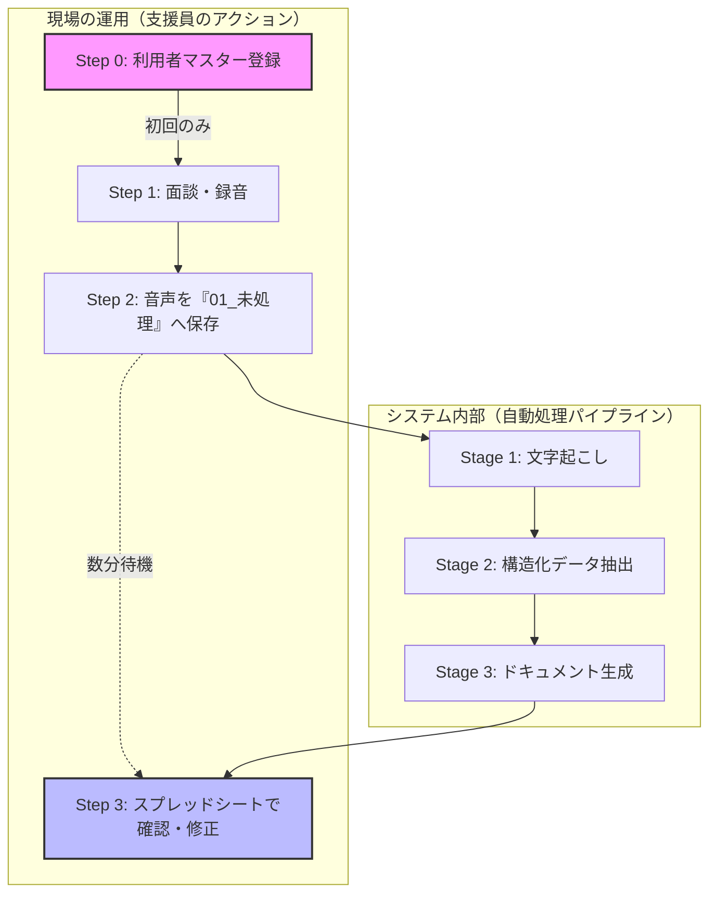

# グローポイント AI支援記録自動化

**「記録の時間は AI に任せ、支援員は『目の前の対話』に集中する」**  
本プロジェクトは、面談音声をアップロードするだけで、モニタリング記録票や就労支援シートの下書きを自動生成する Google Apps Script（GAS）ベースのシステムです。

内部モデルとして最新の **`gemini-2.5-flash`** を採用し、高速かつ精度の高い構造化抽出を実現しています。

### 🔄 全体イメージ

## 📁 日常の運用の流れ

### 【Step 0】利用開始前の準備（初回のみ）
スプレッドシートの **「利用者マスター」** シートへ登録が必要です。ここで登録した名前が、すべての処理の「正解」となります。

### 【Step 1】録音とファイル名（重要：命名規則）
本システムは、ファイル名を **アンダースコア（ `_` ）で区切る** ことで、AIが「誰のデータか」を正確に識別します。

#### ❌ なぜ「田中太郎様.m4a」はダメなのか？
システムは `_` を区切り文字として認識します。区切りがない場合、ファイル名全体（「田中太郎様」）を名前として検索するため、マスターの「田中太郎」と一致せずエラーになります。

#### ✅ 音声ファイル名のルール
- **基本形**: `利用者名_（自由な文字）.m4a`
- **ルール**: 名前の直後に必ず `_` を入れてください。

| ファイル名の例 | 判定 | 理由 |
| :--- | :---: | :--- |
| `田中太郎_面談.m4a` | **OK** | `_` の前が「田中太郎」と判別できる |
| `20260406_田中太郎.wav` | **OK** | `_` で区切られていれば名前を探せます |
| `田中太郎.m4a` | **△** | 処理される場合もありますが、区切りがないと誤認の原因になります |
| `田中太郎様_面談.m4a` | **NG** | 名前が「田中太郎様」として認識されてしまう |
| `田中 太郎_面談.m4a` | **NG** | スペースが含まれると別人とみなされます |

---

## 🛠 開発者・管理者向けセットアップ

### 初回セットアップとフォルダ管理
1. **フォルダの作成**: 「初回セットアップ」を実行すると、**Google Driveのルート**に管理用フォルダ（`グローポイント_支援記録`）が自動作成されます。
2. **フォルダの移動**: 作成されたフォルダは自由に移動して構いません。移動した場合は、プロパティの各 `FOLDER_ID_...` を新しいフォルダのIDに更新してください。

### スクリプト プロパティ一覧
正常な動作のために、以下のプロパティを設定してください。

| カテゴリ | プロパティ名 | 必須 | 説明 |
|:---|:---|:---:|:---|
| **基本設定** | `GEMINI_API_KEY` | はい | Gemini API キー |
| | `SPREADSHEET_ID` | はい | スプレッドシート ID |
| | `TEMPLATE_ID_MONITORING_DOCUMENT` | はい | モニタリング記録票のドキュメント ID |
| **フォルダID** | `FOLDER_ID_ROOT` | (自動) | システム全体のルートフォルダ |
| | `FOLDER_ID_UNPROCESSED` | (自動) | 01_未処理（音声を入れる場所） |
| | `FOLDER_ID_PROCESSING` | (自動) | 02_処理中 |
| | `FOLDER_ID_EXTRACTED` | (自動) | 03_文字起こし・抽出 |
| | `FOLDER_ID_DRAFT` | (自動) | 04_書類ドラフト |
| | `FOLDER_ID_APPROVED` | (自動) | 05_承認済み |
| | `FOLDER_ID_ERROR` | (自動) | 06_エラー |

---

## 🧠 AIの指示（プロンプト）の高度な管理

本システムでは、AIへの命令（プロンプト）を **Google ドキュメント** で管理することを強く推奨しています。

### 設定するとどうなるのか？（メリット）
| 項目 | 設定しない場合（デフォルト） | 設定する場合（おすすめ） |
| :--- | :--- | :--- |
| **修正のしやすさ** | プログラム（GAS）を開いてコードを書き換える必要がある | **Google ドキュメントの文章を書き換えるだけ** |
| **専門知識** | JavaScriptの知識が必要 | 誰でも日本語の文章で指示を調整できる |
| **改善の速さ** | 修正のたびにエンジニアに頼む必要がある | 現場の職員がその場で「もっと具体的に書いて」と改善できる |

### 設定方法
1. 新規の Google ドキュメントを作成し、AIへの具体的な指示（例：「〜の項目を重点的に抽出してください」など）を記述します。
2. 作成したドキュメントの ID を、以下のプロパティに設定します。

| プロパティ名 | 対象ステージ | 説明 |
|:---|:---|:---|
| `PROMPT_FILE_ID_STAGE1` | 文字起こし | 話者の特定や、誤字脱字の修正ルールを指示できます |
| `PROMPT_FILE_ID_STAGE2` | 構造化抽出 | どの情報をどのカテゴリに分類するかを詳細に指定できます |
| `PROMPT_FILE_ID_STAGE3A` | 下書き生成 | 記録票の「語り口」や「まとめ方」をコントロールできます |
| `PROMPT_FILE_ID_STAGE3B` | モニタシート | 総合所見の要約のトーンなどを指定できます |

> **💡 補足**: これらが未設定の場合は、システムに内蔵された標準プロンプト（`prompts.gs`）が使用されます。

---

## 🔍 トラブルシューティング
- **名前は合っているのにエラーになる**: アンダースコア（ `_` ）が含まれているか確認してください。
- **AIの回答が期待と違う**: `PROMPT_FILE_ID_...` を使って、具体的な「お手本」や「禁止事項」をドキュメントに書き込むことで、驚くほど精度が向上します。
