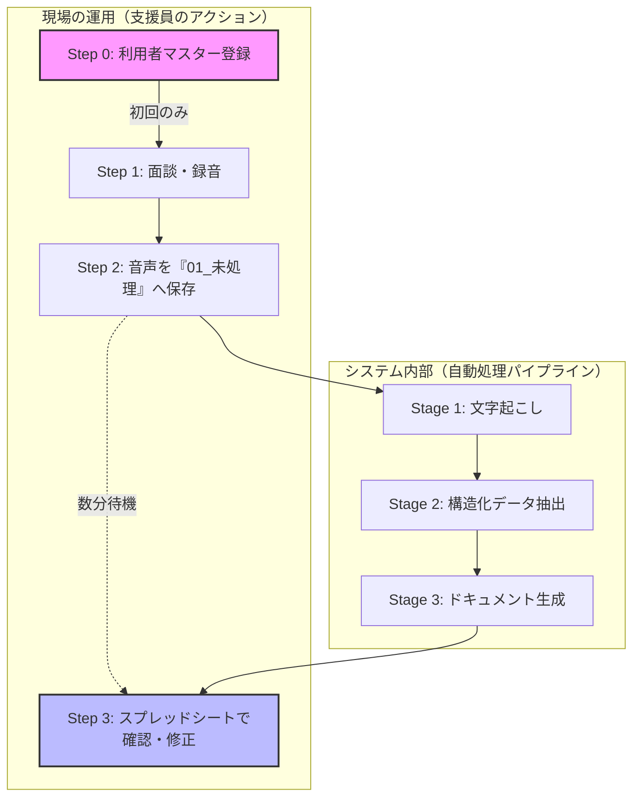

# グローポイント AI支援記録自動化

**「記録の時間は AI に任せ、支援員は『目の前の対話』に集中する」**  
本プロジェクトは、面談音声をアップロードするだけで、モニタリング記録票や就労支援シートの下書きを自動生成する Google Apps Script（GAS）ベースのシステムです。

Gemini API を利用しています。**デフォルトのモデル**（`gas/config.gs` の `CONFIG.GEMINI_MODEL`）は **`gemini-2.5-flash-lite`** で、軽量・高速な呼び出し向けです。一方、**Stage 1（文字起こし）** と **Stage 2（構造化抽出）** は、長尺音声や JSON 品質の都合で **`gemini-2.5-flash`**（`STAGE1_MODEL` / `STAGE2_MODEL`）を明示的に指定しています。Stage 3 など上記以外の呼び出しはデフォルトモデルを使います。

**リポジトリ構成**: `gas/` に Apps Script のソース（`clasp` でプッシュ）、`workers/audio-split/` に長尺音声を **Cloud Run + ffmpeg** で時間分割する任意ワーカー（Docker）があります。

### 🔄 全体イメージ

## 📁 日常の運用の流れ

### 【Step 0】利用開始前の準備（初回のみ）
スプレッドシートの **「利用者マスター」** シートへ登録が必要です。ここで登録した名前が、すべての処理の「正解」となります。

### 【Step 1】録音とファイル名（重要：命名規則）
本システムは、ファイル名を **アンダースコア（ `_` ）で区切る** ことで、AIが「誰のデータか」を正確に識別します。

#### ❌ なぜ「田中太郎様.m4a」はダメなのか？
システムは `_` を区切り文字として認識します。区切りがない場合、ファイル名全体（「田中太郎様」）を名前として検索するため、マスターの「田中太郎」と一致せずエラーになります。

#### ✅ 音声ファイル名のルール
- **基本形**: `利用者名_（自由な文字）.m4a`
- **ルール**: 名前の直後に必ず `_` を入れてください。

| ファイル名の例 | 判定 | 理由 |
| :--- | :---: | :--- |
| `田中太郎_面談.m4a` | **OK** | `_` の前が「田中太郎」と判別できる |
| `20260406_田中太郎.wav` | **OK** | `_` で区切られていれば名前を探せます |
| `田中太郎.m4a` | **△** | 処理される場合もありますが、区切りがないと誤認の原因になります |
| `田中太郎様_面談.m4a` | **NG** | 名前が「田中太郎様」として認識されてしまう |
| `田中 太郎_面談.m4a` | **NG** | スペースが含まれると別人とみなされます |

#### 長時間音声を扱うとき（2通り）
**A. 手動チャンク（複数ファイル）**  
Google Apps Script の実行時間上限のため、長尺は **複数ファイルに分ける**運用が基本です。拡張子を除いたファイル名の **末尾** に **`_NN-MM`** を付けます（NN=何番目、MM=分割総数。数字は **可変桁**。例として 2 桁で書くことも多いです）。

| 例 | 意味 |
| :--- | :--- |
| `齊藤信恵_2026-04-03_01-03.m4a` | 3分割の1本目 |
| `齊藤信恵_2026-04-03_02-03.m4a` | 3分割の2本目 |

同一利用者・同一面談日の **全チャンクの文字起こしが揃うと**、`03_文字起こし・抽出` 内の該当フォルダで **1本の `…_文字起こし.txt` に自動連結**されます。**先頭チャンク（01/MM）の行だけ** Stage2 以降に進みます（`01` の行が無い場合は **最も若い番号のチャンク行**がリーダーに昇格します）。他チャンクの行は `CHUNK_MERGED` になります。

マージ成功後、**チャンク別の `…_文字起こし_NN.txt` は Drive のゴミ箱へ移動**します（結合済み1ファイルを正とする）。パート別の保持が必要な場合は運用でバックアップしてください。

**B. 長尺1ファイルを Cloud Run で時間分割（任意）**  
`AUDIO_SPLIT_ENABLED=true` かつしきい値バイト数以上の **単一ファイル**は、GAS から Cloud Run ワーカーへ依頼し、ffmpeg で **`_NN-MM` 付きチャンク**として `01_未処理` に戻すことができます（`gas/audioSplit.gs`）。**ファイル名末尾が既に `_NN-MM` と解釈できるチャンク**は、この自動分割の対象外です（手動チャンクと二重に割らないため）。ワーカーのデプロイ・環境変数・共有ドライブ上の注意は **`workers/audio-split/README.md`** および **`workers/audio-split/DEPLOY.md`** を参照してください。

---

## 🛠 開発者・管理者向けセットアップ

### clasp で GAS をプッシュ／プルする場合

1. **ディレクトリ**: リポジトリには `gas/` があり、`.clasp.json.example` の `rootDir` は `"gas"` です。ローカルで別レイアウトにする場合は `rootDir` を合わせ、**プッシュ対象の `.gs` をそのディレクトリ配下に置いてください**（空の `gas/` を自分で作る必要は通常ありません）。
2. **scriptId（Apps Script のプロジェクト ID）**: [Google Apps Script](https://script.google.com/) で対象プロジェクトを開き、左の歯車 **プロジェクトの設定** → **スクリプト ID** をコピーします。
3. **設定ファイル**: リポジトリ直下に `.clasp.json` を置き、`scriptId` に上記を貼り付けます（テンプレートは `.clasp.json.example` をコピーしてリネーム）。
4. **認証と基本コマンド**（初回）: `npm i -g @google/clasp` のうえ `clasp login` で Google アカウントにログインし、`clasp push` で `gas/` の内容をクラウドへ反映、`clasp pull` で取得します。

`YOUR_APPS_SCRIPT_ID` のままでは push できないため、必ず実プロジェクトのスクリプト ID に差し替えてください。

### 初回セットアップとフォルダ管理
1. **フォルダの作成**: 「初回セットアップ」を実行すると、**Google Driveのルート**に管理用フォルダ（`グローポイント_支援記録`）が自動作成されます。運用では **共有ドライブ（Team Drive）上**に置くと、サービスアカウント連携やクォータの面で有利なことが多いです。
2. **フォルダの移動**: 作成されたフォルダは自由に移動して構いません。移動した場合は、プロパティの各 `FOLDER_ID_...` を新しいフォルダのIDに更新してください。

### スクリプト プロパティ一覧
正常な動作のために、以下のプロパティを設定してください。

| カテゴリ | プロパティ名 | 必須 | 説明 |
|:---|:---|:---:|:---|
| **基本設定** | `GEMINI_API_KEY` | はい | Gemini API キー |
| | `SPREADSHEET_ID` | はい | スプレッドシート ID |
| | `TEMPLATE_ID_MONITORING_DOCUMENT` | はい | モニタリング記録票のドキュメント ID |
| **フォルダID** | `FOLDER_ID_ROOT` | (自動) | システム全体のルートフォルダ |
| | `FOLDER_ID_UNPROCESSED` | (自動) | 01_未処理（音声を入れる場所） |
| | `FOLDER_ID_PROCESSING` | (自動) | 02_処理中 |
| | `FOLDER_ID_EXTRACTED` | (自動) | 03_文字起こし・抽出 |
| | `FOLDER_ID_DRAFT` | (自動) | 04_書類ドラフト |
| | `FOLDER_ID_APPROVED` | (自動) | 05_承認済み |
| | `FOLDER_ID_ERROR` | (自動) | 06_エラー |
| **長尺分割（任意）** | `AUDIO_SPLIT_ENABLED` | いいえ | `true` で GAS 実行時間超過しやすい大容量音声を Cloud Run + ffmpeg で時間分割 |
| | `AUDIO_SPLIT_WORKER_URL` | ※ | 例: `https://音声分割サービス-xxxxx.run.app`（末尾 `/` 不要） |
| | `AUDIO_SPLIT_SECRET` | ※ | ワーカーと共有する Bearer トークン（十分に長いランダム文字列） |
| | `AUDIO_SPLIT_CHUNK_SECONDS` | いいえ | 1チャンクの秒数（既定 1200 = 20 分） |
| | `AUDIO_SPLIT_MIN_BYTES` | いいえ | このバイト数以上のファイルだけ分割ルートへ（既定 約15MB） |

※ `AUDIO_SPLIT_ENABLED=true` のとき、**`AUDIO_SPLIT_WORKER_URL`**（末尾 `/` なし）と **`AUDIO_SPLIT_SECRET`** は必須です。Cloud Run 側の **`CLOUD_RUN_SERVICE_URL`** は、デプロイ後の実サービス URL と一致させてください（不一致だと Cloud Tasks からの実行が失敗します）。ビルド・デプロイ・トラブルシュートは **`workers/audio-split/README.md`** と **`workers/audio-split/DEPLOY.md`** を参照してください。

---

## 🧠 AIの指示（プロンプト）の高度な管理

本システムでは、AIへの命令（プロンプト）を **Google ドキュメント** で管理することを強く推奨しています。

### 設定するとどうなるのか？（メリット）
| 項目 | 設定しない場合（デフォルト） | 設定する場合（おすすめ） |
| :--- | :--- | :--- |
| **修正のしやすさ** | プログラム（GAS）を開いてコードを書き換える必要がある | **Google ドキュメントの文章を書き換えるだけ** |
| **専門知識** | JavaScriptの知識が必要 | 誰でも日本語の文章で指示を調整できる |
| **改善の速さ** | 修正のたびにエンジニアに頼む必要がある | 現場の職員がその場で「もっと具体的に書いて」と改善できる |

### 設定方法
1. 新規の Google ドキュメントを作成し、AIへの具体的な指示（例：「〜の項目を重点的に抽出してください」など）を記述します。
2. 作成したドキュメントの ID を、以下のプロパティに設定します。

| プロパティ名 | 対象ステージ | 説明 |
|:---|:---|:---|
| `PROMPT_FILE_ID_STAGE1` | 文字起こし | 話者の特定や、誤字脱字の修正ルールを指示できます |
| `PROMPT_FILE_ID_STAGE2` | 構造化抽出 | どの情報をどのカテゴリに分類するかを詳細に指定できます |
| `PROMPT_FILE_ID_STAGE3A` | 下書き生成 | 記録票の「語り口」や「まとめ方」をコントロールできます |
| `PROMPT_FILE_ID_STAGE3B` | モニタシート | 総合所見の要約のトーンなどを指定できます |

> **💡 補足**: これらが未設定の場合は、システムに内蔵された標準プロンプト（`prompts.gs`）が使用されます。

---

## 🔍 トラブルシューティング
- **名前は合っているのにエラーになる**: アンダースコア（ `_` ）が含まれているか確認してください。
- **AIの回答が期待と違う**: `PROMPT_FILE_ID_...` を使って、具体的な「お手本」や「禁止事項」をドキュメントに書き込むことで、驚くほど精度が向上します。
- **処理状況シートの「チャンク」列が日付に化ける**: セルに `01/02` のように入れるとスプレッドシートが **日付型**に解釈することがあり、ファイル名や表示が崩れます。チャンクは **文字列として** `01/02` 形式で入れるか、表示形式を調整してください。
- **長尺分割ワーカーが動かない・止まったように見える**: GAS の **`AUDIO_SPLIT_WORKER_URL`** と Cloud Run の実 URL、およびワーカー環境変数 **`CLOUD_RUN_SERVICE_URL`** が一致しているか確認してください。Cloud Tasks のキューが **一時停止（pause）** のままだとタスクが流れません（`resume` が必要）。無リクエスト時は Cloud Run がスケールゼロになるだけで、次の依頼で再開します。詳細は `workers/audio-split/README.md` を参照してください。
